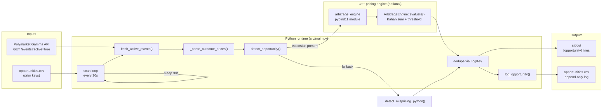

# Polymarket Arbitrage Scanner

A scanner that polls active Polymarket markets and flags potential mispricing.

It reads event data, parses each market's outcome prices, and flags markets where the implied probabilities drift far enough from 1.0 to be worth a closer look.

This is a **signal generator**, not an execution bot. It surfaces markets that deserve manual review.

## Detection Logic

For each market with prices $p_1, p_2, ..., p_n$:

$$
\left|\sum_{i=1}^{n} p_i - 1.0\right| > 0.02
$$

If this condition holds, the market is logged as an opportunity with:

- `question`
- `prices`
- `price_sum`
- `spread` (`max(prices) - min(prices)`)

The scanner deduplicates entries with a rounded key and appends new opportunities to `opportunities.csv`.

## Architecture And Data Flow

Python owns I/O, parsing, persistence, and the poll loop. The optional C++ extension owns the threshold-sensitive pricing check (Kahan-compensated summation). If the extension is missing, the same check runs in pure Python.



### Scan-loop responsibilities

| Stage | Owner | Input | Output |
| --- | --- | --- | --- |
| Fetch | Python | HTTP events payload | list of event dicts |
| Parse | Python | `outcomePrices` (JSON string or list) | `list[float]` or skip |
| Price check | C++ if loaded, else Python | question + prices | opportunity or `None` |
| Persist | Python | new opportunity | CSV row + stdout line |

## Sample CLI Run

### 1) Environment setup

```bash
python3 -m venv .venv
source .venv/bin/activate
pip install -r requirements.txt
```

### 2) Run the scanner

```bash
python -m src.main
```

The process is continuous (polls every 30 seconds). Stop with `Ctrl+C`.

### Example output (captured from a live run)

```text
[backend] C++ module not found; using Python fallback.
Loaded 0 prior opportunities from opportunities.csv
New opportunities this cycle: 0
Waiting 30s...
New opportunities this cycle: 0
Waiting 30s...
```

When a market crosses the threshold and has not been logged before, output includes lines like:

```text
[opportunity] Will candidate X win the primary?
    prices=[0.62, 0.45]  sum=1.070000  spread=0.170000
```

### How to read that output

- `[backend] ...` tells you whether pricing ran in C++ or the Python fallback. Behavior is the same threshold rule either way; C++ uses Kahan summation for stabler totals near the cutoff.
- `Loaded N prior opportunities...` means dedupe keys were restored from `opportunities.csv`, so repeats are not re-appended.
- `New opportunities this cycle: N` is the count of **newly logged** markets in that poll, not the total number of active markets.
- An `[opportunity]` block means `|sum(prices) - 1.0| > 0.02` for that market snapshot. It is a screen for manual review, not a trade instruction.

## Why I Added a C++ Backend

This project started as a Python scanner that polls Polymarket and flags potential mispricing. Once the first version was working, I looked at which step most directly controls whether a market gets flagged. The threshold check stood out because it is the core decision point: when the total price is close to 1.0, small numerical differences can matter.

That led me to dig deeper into floating-point summation and threshold comparisons. I learned that floating-point addition can accumulate rounding error, which matters when a decision depends on whether a total lands just above or below a threshold. To make that step more stable, I added a C++ backend for the pricing check and used Kahan-compensated summation.

The project now combines Python and C++: Python handles API I/O and persistence, while C++ handles the threshold-sensitive pricing check.

## Build And Use The C++ Extension

```bash
cd cpp/build
cmake .. -DCMAKE_BUILD_TYPE=Release
cmake --build . --parallel
cp arbitrage_engine*.so ../../src/
```

Then run `python -m src.main` again. On startup you should see:

```text
[backend] C++ ArbitrageEngine loaded (Kahan-based check active).
```

## Limitations And Risk Model

This tool is intentionally narrow. Keep these constraints in mind when reading its output.

### Practical limits

- **Latency / staleness.** The scanner polls every 30 seconds over HTTP. By the time a row is printed, the book may already have moved. There is no websocket streaming and no co-located feed.
- **Fees and costs.** Flagged spreads ignore trading fees, gas/bridge costs (if any), and slippage. A sum that looks attractive on raw outcome prices can disappear after costs.
- **Partial fills and depth.** The check uses listed outcome prices only. It does not model available size, order-book depth, or partial fills.
- **API reliability.** Gamma API responses can be slow, rate-limited, or shaped differently than expected. Network errors are logged and the loop continues; malformed `outcomePrices` values are skipped.
- **Regulatory / Terms of Service.** Prediction-market access and automated tooling may be restricted by jurisdiction and by Polymarket's terms. This repository does not provide legal advice; operators are responsible for compliance.

### What this tool does **not** claim to do

- It does **not** place, cancel, or manage orders.
- It does **not** guarantee risk-free or executable arbitrage.
- It does **not** account for fees, inventory, or settlement risk.
- It does **not** provide financial advice or a production trading system.

Treat every opportunity as a candidate for human inspection.

## Project Layout

- `src/main.py`: polling loop, API fetch, parsing, opportunity detection, CSV persistence.
- `cpp/include/arbitrage/engine.hpp`: core engine interface.
- `cpp/src/engine.cpp`: Kahan-based evaluation and batch scanning.
- `cpp/src/bindings.cpp`: pybind11 bridge exposing C++ types to Python.
- `cpp/tests/test_engine.cpp`: C++ unit tests for edge cases and threshold behavior.
- `tests/`: Python unit tests (pricing core + parser edge cases).

## Development And Verification

### Python quality gates

```bash
ruff check src tests
ruff format --check src tests
mypy --strict src
python -m pytest
```

### C++ build and tests

```bash
mkdir -p cpp/build && cd cpp/build
cmake .. -DCMAKE_BUILD_TYPE=Debug
cmake --build . --parallel
ctest --output-on-failure
```

### Optional C++ style/static-analysis targets

```bash
cmake --build . --target format-check
cmake --build . --target tidy-check
```

CI (GitHub Actions) runs the Python suite and the C++ build/tests on every push and pull request.

## What This Project Demonstrates

- Market-data ingestion and defensive parsing.
- Threshold-based mispricing screening.
- Deterministic deduplication and CSV persistence.
- Python plus native C++ extension integration.
- Honest scope: screening signals, not automated trading.
- Lint, typing, and unit-test gating for both language sides.

## License

MIT
